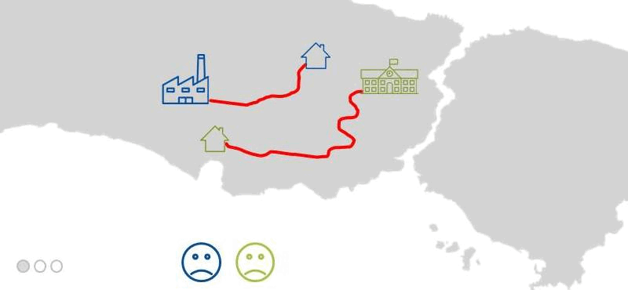

# Home Exchange Matching Algorithms to Reduce Commute Times

This project proposes a system where people living in large cities can reduce their commute times to work or school by exchanging homes with others. The system allows individuals to exchange homes, thus reducing the amount of time spent in traffic. This idea is particularly interesting for **university students** and **apartment residents** in the United States, as it provides a unique solution to the common problem of long commutes.



## Project Objective

The primary goal of this project is to offer an alternative solution to reduce commute times for people living in high-traffic areas. By allowing individuals to exchange homes, the project explores whether commute times can be significantly reduced.

## A Case Study: Home-Exchange Model for University Students in Istanbul

The home-exchange algorithms have been applied to the commute times between the homes and universities of students living in Istanbul. It has been observed that **if students exchange their homes using the algorithms suggested in this study, their commute times can be reduced by more than 50% on average**, highlighting the potential impact of these algorithms on improving daily travel efficiency. 

You can find more details about this study at the following link: [Study Details](https://github.com/yusufbuyruk/home-exchange/releases/download/v1.0.0/home-exchange-algorithms.pdf).

---
## Algorithms Used

The project employs various algorithms to find optimal home exchange matches, including well-known algorithms like **Stable Roommate** and **Top Trading Cycles (TTC)**, as well as the **Preference Rank** algorithm, which I developed specifically for this problem.

1. **Irving's Algorithm** (Stable Roommates Problem):
   - Finds stable matches for reciprocal home exchanges between individuals.
   - Based on the participants' mutual preferences.
   - (Irving 1985)

2. **Gale's Top Trading Cycles Algorithm (TTC)** (Housing Market Problem):
   - Used for multi-match scenarios. It creates a cycle based on each participant's preferences, and participants in the cycle exchange homes.
   - (Shapley and Scarf 1974)

3. **Preference Rank Algorithm** (Proposed Algorithm):
   - Matches participants based on their preference rankings, offering a more flexible and optimized solution for home exchanges.

## 1. Stable Roommate Algorithm (Irving's Algorithm)

Irving's Algorithm is used to compute the stable matching for one-sided matching problems such as the Stable Roommates Problem (Irving 1985). The Stable Roommates Problem involves finding a stable matching for an even-sized set. The general idea behind the algorithm is to pair up elements according to their preference lists within the same set. However, the originally proposed version of the algorithm cannot be directly applied to solve the home-exchange matching problem because, in the Stable Roommates Problem, all agents are matched, while in the home-exchange matching problem, only agents that reduce commute times need to be matched. Therefore, the Stable Roommates Algorithm has been adapted to address the home-exchange matching problem.

The Stable Roommates Algorithm can be broken down into three main steps:

1. **Proposal Phase**:
   - In this phase, candidates make proposals to their preferred choices. The first candidate will propose to their most preferred choice. The candidate being proposed to will hold the proposal unless they receive a better offer, in which case they will reject the pending proposal. Those who get rejected will continue proposing until they are accepted. This process continues until all candidates are holding a proposal or one candidate has been rejected by everyone. If any candidate is rejected by all others, then no stable matching exists in the entire system. In this study, if a candidate is rejected by everyone, they are removed from the match pool, allowing a stable matching to be found among the remaining candidates.

2. **Reduction Phase**:
   - In this step, the preference lists are reduced based on the proposals held by each candidate. Since every person holds a unique proposal, anyone still on their preference list who is less preferred than their current proposed partner can be removed. Everyone rejects candidates who are less desirable than their currently accepted proposal, and this process must be done symmetrically.

3. **Cycle Detection Phase**:
   - If there is more than one preference per agent, the algorithm proceeds to the third step, which involves looking for preference cycles. To detect cycles, two arrays, `p` and `q`, are defined. These arrays help spot repetitions that indicate cycles. The process begins by choosing the first candidate from the preference list of more than one person and assigning it as `p0`. Next, `q0` is defined as the second member of `p0`’s preference list. To find `pi+1`, the algorithm locates the last member of `qi`’s preference list. This process continues, and when the value of `p` is repeated, a preference cycle is complete. To eliminate the cycle, `qi` will reject `pi+1` symmetrically. This process is repeated until only one element remains in each preference list. There may be multiple cycles that need to be eliminated to reach this point. If, after removing cycles, any preference list becomes empty, those agents must be removed from the match pool. However, if any candidate is rejected by all others, they are simply removed from the match pool, but a stable matching may still exist among the remaining candidates.

In the following sections, the pseudocode for the Stable Roommates Algorithm can be referenced for a clearer understanding of the implementation.

### Pseudocode for Stable Roommates Algorithm

```plaintext
while there are unmatched agents do

	let a1 be first unmatched agent
	a1 proposes to its first preference a2 who has not rejected it previously

	if a2 has not receieved a proposal before then
		a2 accepts a1

	else
		if a2 prefers a1 over its current match a3 then
			a2 accepts a1
			reject symmetrically (a2, a3)
		else
			reject symmetrically (a1, a2)
		end if
	end if
end while

for all a2 holding proposal from a1 do
	reject symmetrically all (a2, a3) where a2 prefers a1 over a3
end for

for all cycles in (p1...pn+1) and (q1...qn) such that:
	qi is the second preference of pi and pi+1 is the last preference of qi do

	for i = 1 .. n do
		rejects symmetrically (q1, pi+1)
	end for
end for
```

## 2. Gale’s Top Trading Cycles (TTC) Algorithm

Gale’s Top Trading Cycles (TTC) algorithm is designed to solve indivisible goods trading problems, such as the housing market problem. It was first introduced by Shapley and Scarf in 1974 and is commonly used to find core cycles in each iteration. A core cycle can consist of more than two sides. For example, if agent A prefers agent B, agent B prefers agent C, and agent C prefers agent A, these agents together form a core cycle.

The TTC algorithm operates by identifying these core cycles and allowing agents to trade based on their top preferences. Once a cycle is identified, the agents involved in the cycle are matched and removed from the system, and the process continues with the remaining agents.

However, the TTC algorithm is not an ideal solution for home exchange matching problems, as home exchanges typically require mutual, one-to-one exchanges. Cycle matching, as used in the TTC algorithm, is less practical in this context because home exchange is focused on reducing commute times between two specific locations rather than constructing complex multi-agent trading cycles. Instead, a more direct mutual exchange mechanism is better suited for solving home exchange problems.

### Pseudocode for the Top Trading Cycles (TTC) Algorithm

```plaintext
while there are unmatched agents do

	let a1 be first unmatched agent
	empty cycle_pool

	loop
		if cycle_pool contains a1 then
			while a1 is not the first element of cycle_pool do
				remove the first element in cycle_pool
			end while
			break loop
		else
			add a1 to cycle_pool
			let a1 be the first agent in preference list of a1
		end if
	end loop

	foreach agent a1 in cycle_pool
		match a1 with its first_choice asymmetrically
	end for

	foreach agent in matchpool do
		remove matching agents and update preference list
	end for

end while
```

## 3. Preference-Rank Matching Algorithm

In the final step, a problem-specific home exchange matching algorithm has been designed and applied to the initial state distribution. An agent-based approach is used to define and solve the home exchange problem, where each home location is considered an agent. Each agent maintains a preference list of other agents for home exchange, and the list is sorted by commute times in ascending order. A threshold level is also applied to determine whether an agent is included in another agent’s preference list. Therefore, any match that occurs reduces commute times by at least a certain amount for both agents involved.

In the home exchange matching algorithm, the `PREFERENCE_RANK` value must be calculated for each agent. This value answers the question: **"What is my index number in the preference list of the first agent on my preference list?"** The agent with the smallest `PREFERENCE_RANK` value is paired with its first choice. If two agents have the same `PREFERENCE_RANK`, a tie is broken by random selection. Once a match is found, the paired agents are removed from the matching pool, and other agents update their preference lists. Agents with empty preference lists are also removed from the matching pool. The process is repeated until no agents remain in the matching pool.

### Pseudocode for the Preference-Rank Matching Algorithm

```plaintext
foreach a1 in agents do
	foreach a2 in agents do
		if a1 prefers a2 and a2 prefers a1
			add a2 in preference_list of a1
		end if
	end for
end for

while true
	foreach agent in match_pool do
		if preference_list of agent i empty
			remove agent from match_pool
		else
			find the preference_rank value
		end if
	end for

	if there are no agents in match_pool
		break

	m1 = agent which has the smallest preference_rank value
	m2 = first choice of m1

	match m1 and m2

	remove m1 and m2 from match_pool

	foreach agent in match_pool to
		remove m1 and m2 in preference_list
	end for
end while
```

---
## Share and Cite
- **APA**
  - Buyruk, Y., Cenani, S., & Çağdaş, G. (2022). An Agent-Based Home Exchange Model to Reduce Commute Times of University Students. *International Journal of Digital Innovation in the Built Environment (IJDIBE)*, 11(2), 1-16.
- **Bibtex**
 ```
@article{Buyruk2022Home,
  title={An Agent-Based Home Exchange Model to Reduce Commute Times of University Students},
  author={Buyruk, Yusuf and Cenani, Sehnaz and {\c{C}}a{\u{g}}da{\c{s}}, G{\"u}len},
  journal={International Journal of Digital Innovation in the Built Environment (IJDIBE)},
  volume={11},
  number={2},
  pages={1--16},
  year={2022},
  publisher={IGI Global}
}
 ```
